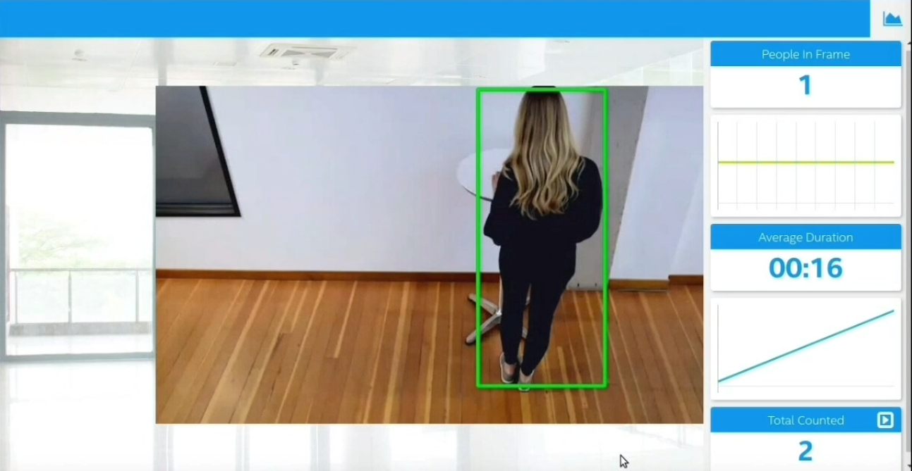
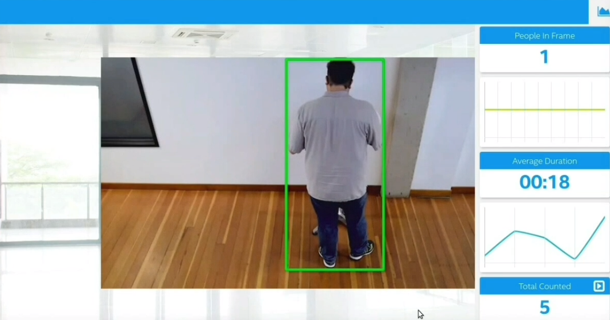

# Deploying a People Counter App at the Edge
---
---
# Project Write-Up

The people counter application will demonstrate how to create a smart video IoT solution using Intel® hardware and software tools. The app will detect people in a designated area, providing the number of people in the frame, average duration of people in frame, and total count.

---

##### Differences in Edge and Cloud computing

Cloud Computing refers to the use of various services such as software development platforms, storage, servers, and other software through internet connectivity. Vendors for cloud computing have three common characteristics which are mentioned below:

Services are scalable
A user must pay the expenses of the services used, which can include memory, processing time, and bandwidth.
Cloud vendors manage the back-end of the application.

Edge Computing allows computing resources and application services to be distributed along the communication path, via decentralized computing infrastructure.

Computational needs are more efficiently met when using edge computing. Wherever there is a requirement of collecting data or where a user performs a particular action, it can be completed in real-time. Typically, the two main benefits associated with edge computing are improved performance and reduced operational costs.

---

## Explaining Custom Layers

The TensorFlow Object Detection Model Zoo (https://github.com/tensorflow/models/blob/master/research/object_detection/g3doc/detection_model_zoo.md) contains many pre-trained models on the coco dataset. Ssd_inception_v2_coco and faster_rcnn_inception_v2_coco are the best fir for the project amidst the other datasets, but, in this project, faster_rcnn_inception_v2_coco is used which is fast in detecting people with less errors. 
Intel openVINO already contains extensions for custom layers used in TensorFlow Object Detection Model Zoo.

The model is downloaded from the GitHub repository of Tensorflow Object Detection Model Zoo by the following command:

```
wget http://download.tensorflow.org/models/object_detection/faster_rcnn_inception_v2_coco_2018_01_28.tar.gz
```
Extracting the tar.gz file by the following command:

```
tar -xvf faster_rcnn_inception_v2_coco_2018_01_28.tar.gz
```
Changing the directory to the extracted folder of the downloaded model:

```
cd faster_rcnn_inception_v2_coco_2018_01_28
```
The model can't be the existing models provided by Intel. So, converting the TensorFlow model to Intermediate Representation (IR) or OpenVINO IR format. The command used is given below:

```
python /opt/intel/openvino/deployment_tools/model_optimizer/mo.py --input_model home/workspace/faster_rcnn_inception_v2_coco_2018_01_28/frozen_inference_graph.pb --tensorflow_object_detection_api_pipeline_config pipeline.config --reverse_input_channels --tensorflow_use_custom_operations_config /opt/intel/openvino/deployment_tools/model_optimizer/extensions/front/tf/faster_rcnn_support.json
```
---

## Comparing Model Performance
the two models taken into account were:

Model-1: Ssd_inception_v2_coco_2018_01_28

The model was converted to intermediate representation using the following command. This model lacked the accuracy needed as it failed to detect people correctly in the video.
```
python /opt/intel/openvino/deployment_tools/model_optimizer/mo.py --input_model ssd_inception_v2_coco_2018_01_28/frozen_inference_graph.pb --tensorflow_object_detection_api_pipeline_config pipeline.config --reverse_input_channels --tensorflow_use_custom_operations_config /opt/intel/openvino/deployment_tools/model_optimizer/extensions/front/tf/ssd_v2_support.json
```

Model-2: Faster_rcnn_inception_v2_coco_2018_01_28

The model was converted to intermediate representation using the following command. Model -2 i.e. Faster_rcnn_inception_v2_coco, performed better in the output video.
```
python /opt/intel/openvino/deployment_tools/model_optimizer/mo.py --input_model faster_rcnn_inception_v2_coco_2018_01_28/frozen_inference_graph.pb --tensorflow_object_detection_api_pipeline_config pipeline.config --reverse_input_channels --tensorflow_use_custom_operations_config /opt/intel/openvino/deployment_tools/model_optimizer/extensions/front/tf/faster_rcnn_support.json
```
---
## Model Research

On comparison of the two models, namely ssd_inception_v2_coco and faster_rcnn_inception_v2_coco several insights were drawn in terms of latency and memory. It is evident that the Latency (microseconds) and Memory (Mb) decreases in case of OpenVINO as compared to plain Tensorflow model which is very useful in case of OpenVINO applications.

| Model/Framework                             | Latency (microseconds)            | Memory (Mb) |
| -----------------------------------         |:---------------------------------:| -------:|
| ssd_inception_v2_coco (plain TF)            | 242                               | 539    |
| ssd_inception_v2_coco (OpenVINO)            | 176                               | 340    |
| faster_rcnn_inception_v2_coco (plain TF)    | 1471                              | 472    |
| faster_rcnn_inception_v2_coco (OpenVINO)    | 874                               | 261    |

---

## Assess Model Use Cases

This application could keep a check on the number of people in a particular area and could be helpful where there is restriction on the number of people present in a particular area. For Exmple it can avoid Overcrowding, ensure safe Vote casting during election and also help people maintain social distance during lockdown.

---
## Assess Effects on End User Needs

Lighting, model accuracy, and camera focal length/image size have different effects on efficiency of th model.
by deploying an edge model, The potential effects of several factors are as follows...
By testing it with different videos and analyzing the model performance on low light input videos could be an important factor in determining the best model for the given scenario.

---
### Running the Main Application

After converting the downloaded model to the OpenVINO IR, the three servers can be started on separate terminals, along with a terminal to run the output i.e. 

-   MQTT Mosca server 
-   Node.js* Web server
-   FFmpeg server

---
#### Setting up the environment

The environment in new terminals needs to be configured to use the Intel® Distribution of OpenVINO™ toolkit one time per session by running the following command:
```
source /opt/intel/openvino/bin/setupvars.sh -pyver 3.5
```
Next,

#### Step 1 - Start the Mosca server

```
cd webservice/server/node-server
node ./server.js
```

The following message is displayed, if successful:
```
Mosca server started.
```

#### Step 2 - Start the GUI

Opening new terminal and executing below commands:
```
cd webservice/ui
npm run dev
```

The following message is displayed, if successful:
```
webpack: Compiled successfully
```

#### Step 3 - FFmpeg Server

Opening new terminal and executing below command:
```
sudo ffserver -f ./ffmpeg/server.conf
```

#### Step 4 - Run the code

Opening new terminal and executing below command:
```
python main.py -i resources/Pedestrian_Detect_2_1_1.mp4 -m home/workspace/faster_rcnn_inception_v2_coco_2018_01_28/frozen_inference_graph.xml -l /opt/intel/openvino/deployment_tools/inference_engine/lib/intel64/libcpu_extension_sse4.so -d CPU -pt 0.4 | ffmpeg -v warning -f rawvideo -pixel_format bgr24 -video_size 768x432 -framerate 24 -i - http://0.0.0.0:3004/fac.ffm
```

---
#### Snapshots :- 

Here are the Screenshots of the project run in http://0.0.0.0:3004  ...





